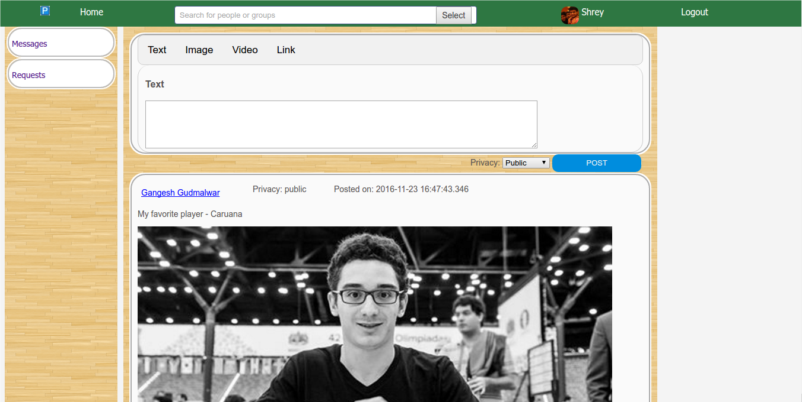

# Profiler - a social webapp

This is a social networking webapp. It has profiles of persons and groups. People
can interact with each other by posts which may have text, photos, links and
videos in them. Posts may have comments and replies. Notifications are sent
to people for any changes like in case of comments and likes. People can chat
in chatbox which may contain more than two people.

It was developed as part of Database and Information Systems Lab course, guided by Prof. S. Sudarshan

Authors: Tejesh Raut, Gangesh Gudmalwar, Shrey Kumar

Date: November 23, 2016

# Table of Contents
1. [Loading the project](#1-loading-the-project)
2. [Setting up server side](#2-setting-up-server-side)
3. [Setting up tomcat server](#3-setting-up-tomcat-server)
4. [Functional specifications](#4-functional-specifications)

	4.1. [Broad goal of project](#41-broad-goal-of-project)

	4.2. [Functions (at a high level) that are supported](#42-functions-at-a-high-level-that-are-supported)

5. [ER diagram for stored data](#5-er-diagram-for-stored-data)
6. [Table design for stored data](#6-table-design-for-stored-data)

	6.1. [Person](#61-person)

	6.2. [Post](#62-post)

	6.3. [Posted_By](#63-posted_by)

	6.4. [Group_or_Wall](#64-group_or_wall)

	6.5. [Posted_on](#65-posted_on)

	6.6. [follower](#66-follower)

	6.7. [Admin](#67-admin)

	6.8. [Request](#68-request)

	6.9. [Tag](#69-tag)

	6.10. [Like](#610-like)

	6.11. [Comment](#611-comment)

	6.12. [Comment_on_by](#612-comment_on_by)

	6.13. [Reply](#613-reply)

	6.14. [Comment_Reply](#614-comment_reply)

	6.15. [Chatbox](#615-chatbox)

	6.16. [Chaters](#616-chaters)

	6.17. [Message](#617-message)

	6.18. [Notification](#618-notification)

	6.19. [Notification_for](#619-notification-for)

7. [Screenshots from the project](#7-screenshots-from-the-project)


### 1. Loading the project

Use the `profiler.sql` file to load the schema in your database. You can populate
the data in it by going on creating new users. Set up the public `/var/www`
folder in the server side for storing of images and videos. It is explained in the
point "Sharing of images used in webapp" of [Setting up server side](#2-setting-up-server-side)

Change the Database handler parameters in the file `DBHandlerParameters.java`
according to your database.

Add the file `java-json.jar` in classpath in your project.

Then run the server.

### 2. Setting up server side

* Install postgresql:

Enter the following commands to install postgresql in server:

```
sudo apt-get update
sudo apt-get install postgresql postgresql-contrib
```
* Set up postgresql:

Path may be slightly different depending on version.

```
cd ~
mkdir postgresql
cd postgresql
/usr/lib/postgresql/9.5/bin/initdb -D dbprojectdb
```
* Changing port number:

edit `dbprojectdb/postgresql.conf` and
change
`#port = 5432`
to
`port = 5081`


* Changing unix socket directories:

Change
`#unix_socket_directories = '/var/run/postgresql`
to
`unix_socket_directories = '/xxx/postgresql'`
where `xxx` is the full path of your home directory

* Sharing database over network (Not necessary if project is running
on the same machine):

Add following line in `postgresql.conf`:

`listen_addresses = '*'`

Add following line in `pg_hba.conf`:

`host all all 0.0.0.0/0 trust`

* Start database server (Everytime you restart PC):

```
/usr/lib/postgresql/9.5/bin/pg_ctl -D ~/postgresql/dbprojectdb/ -l logfile start
```
* Connect to database for debugging database using sql:

`psql -h localhost -p 5081 -d postgres -U <username>`

* Sharing of images used in webapp:

Change the permissions of the html directory in /var/www
If you don't see this directory then you need to install apache

```
sudo apt-get install apache
```
For this you need to open file browser in root mode:

```
sudo nautilus
```
Then browse to the directory `/var/www` and change properties of html folder
to your username


Then create the directory `DBProjectImages` in `/var/www/html` after exiting
from root mode


### 3. Setting up tomcat server

Install tomcat 8

```
sudo apt-get install tomcat
```
Then fix directories structure:

```
cd /usr/share/tomcat
sudo ln -s /var/lib/tomcat8/conf conf
sudo ln -s /var/log/tomcat8 log
sudo ln -s /etc/tomcat8/policy.d/03catalina.policy conf/catalina.policy
sudo chmod -R a+rwx /usr/share/tomcat8/conf
```
Allow startup from inside eclipse (Everytime after restarting PC):

```
/usr/share/tomcat8/bin/shutdown.sh
```
While adding new server in eclipse select add manually and give the path as
`/usr/share/tomcat`


### 4. Functional specifications

#### 4.1. Broad goal of project

This is a social networking webapp. It has profiles of persons and groups. People
can interact with each other by posts which may have text, photos, links and
videos in them. Posts may have comments and replies. Notifications are sent
to people for any changes like in case of comments and likes. People can chat
in chatbox which may contain more than two people.

#### 4.2. Functions (at a high level) that are supported

On logging in user will see newsfeed which contains posts from groups and users' wall whom you follow sorted by time.

You can also see walls of people whom you follow.

You can also see wall of a group which you follow.

You can like a post and also comment on it.

You can also reply to someone's comment on a post.

Search box to search for a group or users by their name which provides links to their walls.

Message url to see all the chats of which you are a participant and all earlier messages in them. You can send messages to them.

Notifications come to user when someone likes his post or comments on it. Notification is also sent when someone replies to his/her comment. They are also sent when someone posts on his/her wall. User is also notified when a new message comes to any of the chats of which he/she is a member.

Groups have admin. They can add new admins. They can also accept requests from other users to follow the group.


### 5. ER diagram for stored data

ER diagram is as below:


### 6. Table design for stored data

#### 6.1. Person

Attributes: PersonID, Firstname, Lastname, Dateofbirth, gender, User-
name, Password, Profilepicture, Address, Otherdetails

All are of type varchar
Profilepicture contains link of the image

#### 6.2. Post

Attributes:PostID, Text, Image, Video, Link, privacy, time

All are of type varchar
Image, Video contain link of the image/video

#### 6.3. Posted_By

Attributes:PersonID, PostID

A user can post many posts but a post can be posted by only one user.

#### 6.4. Group_or_Wall

Attributes:grouporwallid, name, type, Groupdescription, Groupphoto

A place which contains the posts.

#### 6.5. Posted_on

Attributes:PostID, grouporwallid

A post is posted to only one wall or group but a wall or group can contain
many posts.

#### 6.6. follower

Attributes:PersonID, grouporwallid

Maps users with the groups they follow.
A user can follow many groups or walls. A group or wall can be followed by
many users.


#### 6.7. Admin

Attributes:PersonID, grouporwallid

Contains admins of group or wall.
There is a wall for a user whose admin is user himself.

#### 6.8. Request

Attributes:PersonID, grouporwallid

Contains the list of the people who wish to follow a group or wall but are
not a follower yet. Admins can accept the request and allow them to follow.

#### 6.9. Tag

Attributes:PersonID, PostID

Defines the person who is tagged in a post.
A person can be tagged in many posts and many people can be tagged in a
post.

#### 6.10. Like

Attributes:PersonID, PostID

Defines the people who have liked the post.
A user can like many posts and a post can be liked by many people.

#### 6.11. Comment

Attributes:CommentID, Text, time

Comment contains a text and the time at which it was posted.

#### 6.12. Comment_on_by

Attributes:PersonID, CommentID, PostID

Contains the person who commented on a post.
A comment is posted by only one user and on only one post.

#### 6.13. Reply

Attributes:ReplyID, Text, time

Just like there is a comment on a post, there is a reply on a comment.


#### 6.14. Comment_Reply

Attributes:PersonID, ReplyID, CommentID

Just like Commentonby

#### 6.15. Chatbox

Attributes:chatboxID, name

#### 6.16. Chaters

Attributes:PersonID, chatboxID

A chatbox is shared among several people and a person can have several chat-
box. It provides interface for displaying messages only to the members of the
chatbox.

#### 6.17. Message

Attributes:PersonID, chatboxID, Messagetext, time

PersonID here represents the person who sent the message to the chatbox
whose ID is chatboxID
It also has the time at which the message was sent.
A message is sent by only one person and to only one chatbox

#### 6.18. Notification

Attributes:NotificationID, text, seenunseen, time

Contains the notification message for some user. seenunseen denotes whether
the notification is seen or unseen. time denotes the time at which the notification
was generated.

#### 6.19. Notification_for

Attributes:NotificationID, PersonID

Maps the notification to the person to whom it corresponds
A person can have many notifications but every notification is associated with
only one person.


### 7. Screenshots from the project

Project Structure


Main Screen



Comments


Login Screen


Messages


Friend Requests


Sign up


